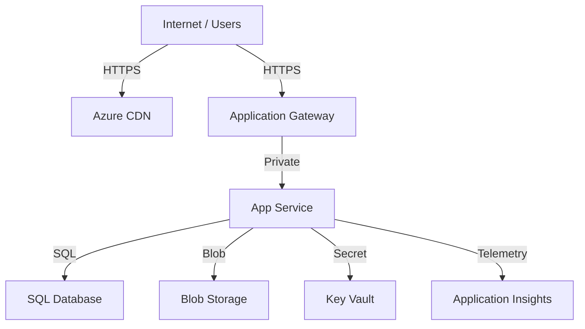

# Azure Resource Visualizer

Generate architecture diagrams and dependency maps from deployed Azure resources.
Identify critical paths, trust boundaries, and potential failures.

## Use This Skill When

- The user asks to visualize an Azure architecture or deployment
- The user needs dependency mapping for troubleshooting or review
- The user needs architecture documentation for compliance or knowledge transfer
- The user wants to understand data flow and trust boundaries

## Context: Visualization Maturity

**Immature**: No diagrams, ad hoc PowerPoint slides, out of sync  
**Developing**: Some Visio or manual diagrams, updated occasionally  
**Managed**: Mermaid/ASCII generated from code/CLI, auto-updated → **Target**  
**Optimized**: Real-time topology from infrastructure code, linked to runbooks and alerts

## Required Inputs

- **Resource inventory**: Subscription ID, resource groups, or IaC code
- **Scope**: Single app, multi-app, entire subscription?
- **Audience**: Architects, developers, operations, auditors?
- **Detail level**: High-level (boxes) or detailed (properties, IPs)?
- **Trust boundaries**: On-premises? External partners?
- **Data flow direction**: Producer → Consumer orientation?

## Decision Tree

```
What's the primary purpose of this diagram?
├─ Architecture review (for design) → High-level, show trade-offs
├─ Troubleshooting (incident) → Detailed, show data paths
├─ Compliance/audit (prove design) → Component-level, highlight controls
└─ Knowledge transfer (team onboarding) → Annotated, include SLOs

What's the intended audience?
├─ Technical architects → Include scaling, redundancy, failover
├─ Developers → Include APIs, data sources, CI/CD
├─ Operations → Include monitoring, alerting, runbooks
└─ Auditors → Include security, compliance, audit points

How detailed should it be?
├─ Executive summary → 3-5 main components, high-level flow
├─ Architecture design → All resources, dependencies, zones
└─ Forensic/detailed → Resource IDs, IPs, security rules, policies
```

## Workflow

### Phase 1: Collect Resource Inventory

1. **Query all resources** (CLI or portal):
   ```bash
   # Get all resources in subscription
   az resource list --query "[].{name:name, type:type, group:resourceGroup}" -o table
   
   # Get all resources with details
   az graph query -q "resources | project name, type, resourceGroup, location, properties" -o table
   ```

2. **Map resource relationships**:
   ```bash
   # Get VNet peering
   az network vnet peering list --resource-group $RG --vnet-name $VNET
   
   # Get service connections
   az network private-endpoint-connection list --resource-group $RG
   
   # Get role assignments
   az role assignment list --all --output table
   ```

3. **Document externals** (on-premises, partner networks, public APIs):
   ```
   ├─ On-premises SQL Server (10.0.0.10)
   ├─ Partner API (api.partner.com)
   ├─ CDN (cdn.example.com)
   └─ Monitoring (Azure Portal, on-call system)
   ```

### Phase 2: Identify Dependencies & Trust Boundaries

1. **Compute → Data dependencies**:
   ```
   App Service
   ├─ Reads: SQL Database, Key Vault, Blob Storage
   ├─ Writes: Application Insights, Blob Storage
   └─ Calls: External API (partner.api.com)
   ```

2. **Network security & isolation**:
   ```
   Public Internet
   └─ [Application Gateway] (0.0.0.0/0)
      └─ [NSG Allow 443]
         └─ [App Service] (private IP 10.1.1.0/24)
            └─ [NSG Allow SQL port 1433 to DB subnet]
               └─ [SQL Database] (private IP 10.1.2.0/24)
   ```

3. **Identity & access paths**:
   ```
   App Service
   └─ System-assigned managed identity
      └─ Role: "Key Vault Secrets User"
         └─ [Key Vault] (access allowed)
   ```

### Phase 3: Generate Diagrams

**Example 1: High-Level Diagram (Mermaid)**


**Example 2: Network Topology (ASCII)**
```
┌─ Public Internet ─────────────────────────────────────────┐
│                                                             │
│  [User Browsers]                                           │
│        │                                                   │
│        ├─→ [Azure CDN] ←─ Static content                  │
│        │                                                   │
│        └─→ [App Gateway] (0.0.0.0/0)                      │
│             │ (443: HTTPS only, deny HTTP)                │
└─────────────┼───────────────────────────────────────────────┘
              │
    ┌─────────▼──────────────────────────────────────────┐
    │ Hub VNet (10.0.0.0/16)                             │
    │  ┌────────────────────────────────────────────┐   │
    │  │ App Subnet (10.0.1.0/24)                   │   │
    │  │  [App Service] (private)                   │   │
    │  │  └─ NSG: Allow 443 from App Gateway        │   │
    │  └────────────────────────────────────────────┘   │
    │           │                                         │
    │           ├─→ DNS (Azure DNS)                       │
    │           │                                         │
    │  ┌────────▼──────────────────────────────────┐     │
    │  │ Data Subnet (10.0.2.0/24)                │     │
    │  │  [SQL Database] (private endpoint)       │     │
    │  │  └─ NSG: Allow 1433 from App Subnet      │     │
    │  └────────────────────────────────────────────┘    │
    │           │                                         │
    │  ┌────────▼──────────────────────────────────┐     │
    │  │ Management Subnet (10.0.3.0/24)         │     │
    │  │  [Key Vault] (private endpoint)         │     │
    │  │  [Storage Account] (for backups)        │     │
    │  └────────────────────────────────────────────┘    │
    └─────────────────────────────────────────────────────┘
              │
    ┌─────────▼──────────────────────────────────────────┐
    │ Monitoring & Logging (Shared)                      │
    │  [Log Analytics Workspace]                         │
    │  [Application Insights]                            │
    │  [Storage Account] (logs archive)                  │
    └─────────────────────────────────────────────────────┘
```

**Example 3: Data Flow Diagram**
```
┌─ Producer ─────┐
│ Event Source   │
│ (Order placed) │
└───────┬────────┘
        │
        └──→ Service Bus Topic: "order-events"
             │
             ├──→ Subscription: "email-service" ──→ Logic App ──→ Send Email
             │
             ├──→ Subscription: "inventory-service" ──→ Function ──→ Update Inventory
             │
             └──→ Subscription: "analytics-service" ──→ Event Hub ──→ Stream Analytics
                                                                      ├──→ Power BI (dashboard)
                                                                      └──→ Alert (if anomaly)
```

### Phase 4: Annotate Risk & Critical Paths

1. **Single points of failure**:
   ```
   ⚠️ Critical Path: Users → Application Gateway → App Service → SQL Database
      - If App Gateway fails: No user access
      - If App Service fails: No processing
      - If SQL Database fails: Data unavailable
   
   ✓ Mitigations in place:
      - Application Gateway: 2+ instances (auto-scale)
      - App Service: Standard tier (2+ instances), auto-scale
      - SQL Database: GRS (geo-redundant), 35-day backup retention
   ```

2. **Security boundaries**:
   ```
   ✓ Secure:
      - Private endpoints: DB, Key Vault (not on internet)
      - NSG rules: Deny by default, allow explicitly
      - HTTPS only: TLS 1.2+, no HTTP
   
   ⚠️ Risk:
      - App Gateway is public (but only accepts 443)
      - Application does not filter PII in logs (audit needed)
   ```

3. **Compliance markers**:
   ```
   🔒 Encryption:
      - In-transit: All APIs use HTTPS
      - At-rest: Database TDE enabled, Storage CMK
   
   📊 Audit Trail:
      - All API calls → Application Insights
      - All database operations → SQL Audit
      - All storage access → Storage logging
   
   🔑 Access Control:
      - App Service: Managed identity, no secrets in config
      - Database: Azure AD authentication
      - Key Vault: RBAC (not access policies)
   ```

### Phase 5: Create Documentation

1. **Markdown format**:
   ```markdown
   # Architecture Overview
   
   ## High-Level Diagram
   [Include Mermaid or ASCII diagram]
   
   ## Components
   - **Frontend**: App Service (P1V2, 2 instances)
   - **Database**: SQL Database (S2 tier, GRS)
   - **Cache**: Azure Cache for Redis (C1 tier, 1GB)
   
   ## Data Flow
   1. User uploads file to Blob Storage
   2. Blob trigger fires Function
   3. Function processes file, stores metadata in SQL
   4. App Service queries metadata, returns to user
   
   ## Scaling
   - Baseline: 2 instances
   - Max: 10 instances (CPU > 80%)
   
   ## Resilience
   - **Availability**: 99.95% (21 min downtime/month acceptable)
   - **RTO**: 4 hours (restore from backup)
   - **RPO**: 15 minutes (backup frequency)
   ```

2. **Update CI/CD documentation**:
   - Add diagram links to README.md
   - Update architecture decisions in ADR (Architecture Decision Records)
   - Link to compliance controls (ISO, SOC2, HIPAA)

## Output Contract

1. **High-Level Topology Summary**
   - Components: Compute, storage, networking, identity
   - Data flow: Producer → Service → Consumer
   - External integrations: On-premises, partners, public APIs

2. **Detailed Architecture Diagram**
   - Format: Mermaid, ASCII, or JSON
   - Include: Trust boundaries, security zones, redundancy
   - Annotate: Resource IDs, sizing, configuration

3. **Dependency & Risk Analysis**
   - Single points of failure identified
   - Critical paths highlighted
   - Resilience score (redundancy, auto-scale, backup)

4. **Security & Compliance Markers**
   - Encryption: At-rest, in-transit
   - Access control: Identities and permissions
   - Audit trail: Logging and monitoring

5. **Documentation Artifacts**
   - Architecture document (Markdown)
   - Runbooks: Failover, scale-out, disaster recovery
   - Compliance checklist: Controls mapped to resources

## Guardrails

- **Keep diagrams readable**: Don't show >15 resources in one view; use layers.
- **Distinguish inferred links from confirmed**: Mark assumed dependencies; verify with CLI.
- **Avoid exposing secrets**: No API keys, passwords, or connection strings in diagrams.
- **Update with changes**: Keep diagrams in version control (Markdown + code).
- **Audience-appropriate**: Executives see 3 boxes; architects see 30+ components.
- **Link to monitoring**: Annotate diagrams with alert thresholds (CPU >80%, latency >500ms).
- **Include operational runbooks**: Link to failover, scaling, and incident response procedures.
